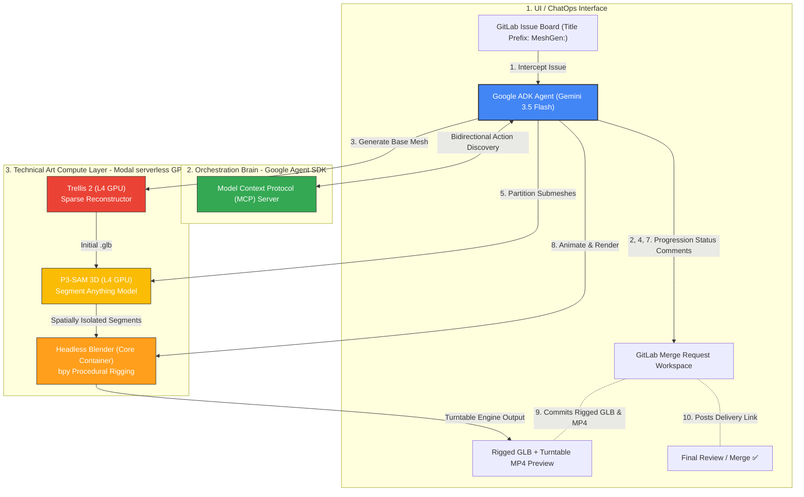

# GitMesh 🚀 (Headless Autonomous 3D Technical Art Pipeline Agent)

GitMesh is a fully headless, autonomous **CO-OP CI/CD agent** engineered to break the single greatest bottleneck in game development: manual 3D asset generation, mesh cleanup, semantic splitting, skeletal rigging, and visual turntable proofing. 

By utilizing a ChatOps-driven workflow, **GitLab's Issue Board and Merge Requests (MRs)** serve as the entire user interface. Technical artists, game designers, and developers request assets inside standard tickets; GitMesh automatically intercepts, triggers massive high-performance remote GPU pipelines, and commits rigged game-ready assets alongside proof-of-work streaming renders back to the repository branch—completely unsupervised.

---

## 🚀 How It Works (The 10-Step Pipeline)

When a developer opens a GitLab issue with a title that starts with `MeshGen:`, the **Google Agent Development Kit (ADK)**-powered brain takes total control, executing a sequential 10-step development pipeline:



### The Breakdown:
1. **Issue Analysis**: The agent intercepts a GitLab issue containing physical prop parameters (e.g., *"Lowpoly Pirate Chest, oak wood"*), automatically instantiates a new local Git branch, and opens a Merge Request.
2. **Handshake Post**: The agent comments on the MR: `"Initializing GitMesh Pipeline: Generating base 3D mesh..."` 
3. **Sparse Reconstruction (Trellis 2)**: Triggers serverless GPU routines on Modal to reconstruct a dense 3D point cloud and generate an initial clean `.glb` mesh envelope.
4. **Interim Post**: Comments on the MR: `"Mesh completed. Segmenting semantic parts..."`
5. **Semantic Part Segmentation (P3-SAM)**: Sends the mesh raw vertex buffers to **P3-SAM** (Segment Anything Model 3D) to automatically group discrete components (e.g., isolating a chest's *lid* from its *base*).
6. **Kinetic Intelligence Core**: The agent's LLM brain parses the segmented components with spatial coordinates and crafts custom mechanical movement plans in standard JSON.
7. **Animation Handshake**: Comments on MR: `"Applying procedural rigging and rendering preview..."`
8. **Headless Blender Rigging (`bpy` + Workbench)**: Deploys a headless Blender container on Modal to write bone weights and keyframe the turntable loops.
9. **Turntable Rendering**: Renders a standard turntable movie (`.mp4`) at 60 FPS using Blender's rapid Workbench engine.
10. **Delivery & PR Checkout**: Pushes the finished `.glb` and preview `.mp4` into the Git repository branch, uploads structural markdown video embeds directly inside the MR comments, and updates MR status metadata to `ready for review`.

---

## 🏛️ System Architecture

GitMesh bridges cloud-native enterprise developer interfaces (GitLab) with state-of-the-art serverless GPU clusters using structured AI coordination:

- **Google Agent Development Kit & Gemini API Key Server**: Orchestrates the multi-layered decisions, tool selection, and code injection sequences.
- **Model Context Protocol (MCP)**: Standardizes tool declarations, executing low-level shell commands to spin up the `@gitlab/mcp-server-gitlab` bridge and communicate via bidirectional stdio streams.
- **Serverless Task Container Blocks (Modal)**: Offloads heavy memory/processing pipelines into cold-start optimized micro-containers running on state-of-the-art neural cores on-demand.

---

## 🛠️ The Tech Stack

- **google-adk (Google Agent Development Kit)**: High-level Python developer SDK mapping system instructions into safe tool belts, managing recursive function calls, and carrying out multi-step code and design tasks with `gemini-3.5-flash`.
- **Model Context Protocol (MCP)**: Universal context gateway standard allowing the Gemini developer brain to discover, call, and coordinate standard Git APIs securely over the `@gitlab/mcp-server-gitlab` dynamic tool schema.
- **Modal Serverless Platforms**:
    - **Trellis 2 (3D Generation)**: Runs serverless inference over state-of-the-art transformer 3D geometry builders on L4 GPUs.
    - **GPU profile**: Runtime is pinned to L4 to avoid binary/package incompatibilities across GPU classes.
  - **P3-SAM**: Runs high-accuracy part-to-semantic segmentation models.
  - **Blender headless**: Standard Debian environments running custom `bpy` tasks to rig objects programmatically.
- **FastAPI / Python 3.11**: Event-driven client core orchestrating background tasks, handling continuous streams of webhook events, and driving state machine processes.

---

## Remote Production Setup

GitMesh is intended to run remotely from GitLab. Local setup is only for development and debugging; end users should only need to open a GitLab issue.

One-time operator setup:

0. Create a Google Cloud project and get the project ID:

```bash
# Create project (choose your own globally unique PROJECT_ID)
gcloud projects create YOUR_PROJECT_ID --name="GitMesh Production"

# Set active project for subsequent commands
gcloud config set project YOUR_PROJECT_ID

# Print active project ID (use this value for GCP_PROJECT_ID)
gcloud config get-value project
```

If you prefer the Console UI:
1. Go to Google Cloud Console, create/select a project.
2. Open IAM & Admin > Settings.
3. Copy the Project ID (not Project Name).

1. Enable Vertex AI in the Google Cloud project:

```bash
gcloud services enable aiplatform.googleapis.com
```

2. Create a narrowly scoped service account for Vertex calls and grant it Vertex AI access. Store its JSON key securely.

3. Fill `.env` from `.env.example` with real values:

```text
GCP_PROJECT_ID=...
GCP_SERVICE_ACCOUNT_JSON={...}
GITLAB_PROJECT_ID=...
GITLAB_API_TOKEN=...             # token with API access to project vars/hooks/issues
GITLAB_TRIGGER_TOKEN=...
GITLAB_WEBHOOK_SECRET=...
MODAL_TOKEN_ID=...
MODAL_TOKEN_SECRET=...
AUTO_CLOSE_ISSUE=true            # default: close issue at pipeline completion
```

Optional values:

```text
GITLAB_URL=https://gitlab.com    # set this for self-managed GitLab
WEBHOOK_URL=                     # override webhook URL if deploy output parsing fails
GITLAB_TRIGGER_REF=main
LLM_PROVIDER=vertex
IMAGE_MODEL=gemini-3.1-flash-image
```

4. Run the one-command bootstrap:

```powershell
pwsh ./setup_remote.ps1
```

What `setup_remote.ps1` does automatically (rerun-safe GitLab API flow):
- Validates required `.env` keys.
- Replaces and recreates Modal secret `gitmesh-keys` with runtime values used by `modal_app.py` and `gitlab_webhook.py`.
- Deploys `gitlab_webhook.py` and `modal_app.py`.
- Upserts GitLab CI/CD variables (`MODAL_TOKEN_ID`, `MODAL_TOKEN_SECRET`, `GITLAB_API_TOKEN`, `GITLAB_TRIGGER_TOKEN`, `GITLAB_WEBHOOK_SECRET`, `GITLAB_TRIGGER_REF`) with sensitive values masked and unprotected by default.
- Creates or updates the GitLab project webhook for Issue events with your webhook secret.
- Leaves issue auto-close enabled by default; set `AUTO_CLOSE_ISSUE=false` in GitLab CI/CD variables to keep issues open after completion.

Useful flags:

```powershell
pwsh ./setup_remote.ps1 -SkipDeploy
pwsh ./setup_remote.ps1 -SkipGitLabApi
pwsh ./setup_remote.ps1 -DryRun
pwsh ./setup_remote.ps1 -ProtectSensitiveVars
pwsh ./setup_remote.ps1 -WebhookUrl https://<your-webhook-url>
```

Do not set `GEMINI_API_KEY` in GitLab production. The CI preflight enforces `LLM_PROVIDER=vertex` and fails early if a Gemini API key is present.

5. Trigger flow for end users:

```text
Open GitLab issue with title: MeshGen: <asset request>
GitLab webhook/trigger starts CI
CI validates remote config and calls Modal
Modal runs L4 GPU stages and posts progress/results back to GitLab
```

---

## 🚀 Sandbox Simulation Runs

GitMesh is configured with a **Vertex AI first** auth strategy. `GEMINI_API_KEY` is only a local fallback.

### Vertex AI Setup (Recommended Default)

If someone clones this repo, use the following setup steps before running pipeline stages that call Gemini/Imagen:

```bash
# 1) Install and initialize gcloud CLI (one-time)
gcloud auth login
gcloud config set project YOUR_GCP_PROJECT_ID

# 2) Create Application Default Credentials for local SDK auth
gcloud auth application-default login

# 3) (Recommended) verify ADC token works
gcloud auth application-default print-access-token
```

Minimum required Google Cloud APIs for this project:

```bash
gcloud services enable aiplatform.googleapis.com
```

For local `.env`:

```bash
GCP_PROJECT_ID="YOUR_GCP_PROJECT_ID"
LLM_PROVIDER="vertex"
GEMINI_API_KEY="optional-fallback-only"
```

Provider modes:

```bash
# Vertex-only (recommended default)
LLM_PROVIDER="vertex"

# Gemini API key only
LLM_PROVIDER="gemini"

# Vertex first, then Gemini fallback
LLM_PROVIDER="auto"
```

Image model quality/cost tuning:

```bash
# Recommended default
IMAGE_MODEL="gemini-3.1-flash-image"

# Alternative Imagen and Gemini models
IMAGE_MODEL="gemini-3.5-flash"
IMAGE_MODEL="imagen-4.0-fast-generate-001"
IMAGE_MODEL="imagen-4.0-generate-001"
```

GitMesh will automatically fall back through supported image model IDs if the preferred one is unavailable in your region/project.

For CI/Modal secrets, prefer Vertex credentials and keep `GEMINI_API_KEY` unset unless you intentionally want fallback behavior.

To spin up and simulate the local pipeline dry-run, tool-belt synthesis, and mock agent cycle:

```bash
# Export standard API tokens
export GEMINI_API_KEY="your-gemini-key"
export GITLAB_PRIVATE_TOKEN="your-gitlab-token"

# Run the central orchestrator
python3 agent.py
```

Optional environment variables for webhook/trigger components:

```bash
export GITLAB_PROJECT_ID="your-gitlab-project-id"
export GITLAB_TRIGGER_TOKEN="your-gitlab-pipeline-trigger-token"
export GITLAB_TRIGGER_REF="main"
export GITLAB_WEBHOOK_SECRET="your-gitlab-webhook-secret"
```

---

## 🔮 V2 Roadmap (Hackathon Future Pitch)

During game production, 3D props are completely empty without **organic sound design** to accompany their visual kinetic animation cues (e.g. wood creaking during a trunk-lid opening, steel echoing during sword swings).

- **AudioLDM 2 Integration on Modal**: Add an extra orchestration tool `generate_audio_fx_for_part`.
- **Procedural Sound Trigger Maps**: GitMesh's LLM brain will analyze the animation plan and auto-generate precise SFX (mp3 files) synchronized exactly with Blender keyframe limits.
- **Dynamic GLTF Audio Ext**: Output unified spatial objects directly packaged with audio triggers, delivering a fully interactive visual-audio pipeline directly out of CI/CD.
