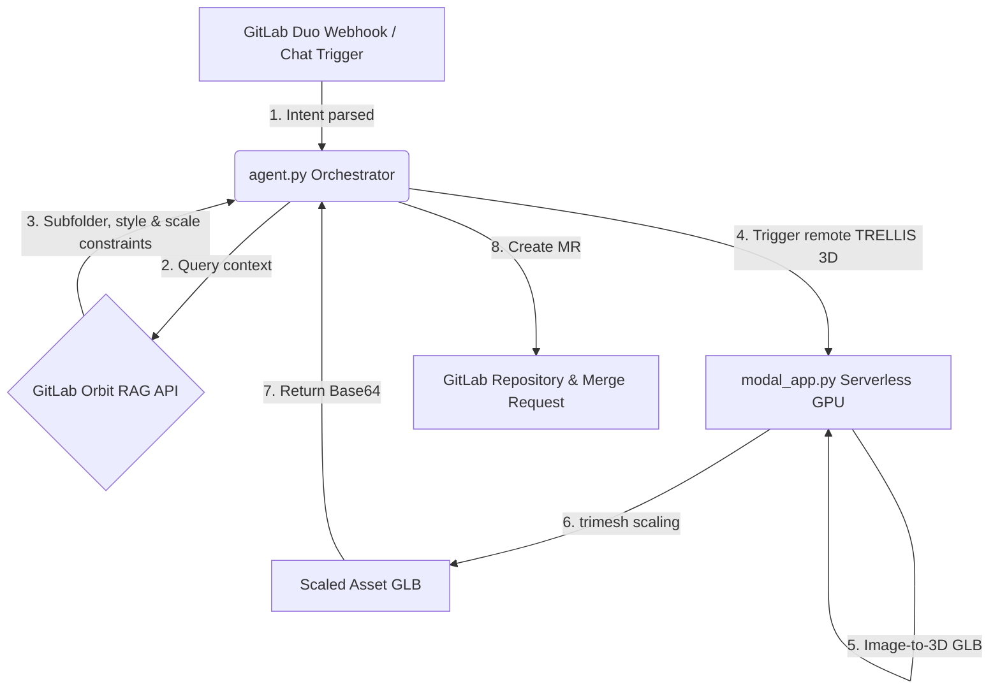

# GitMesh: Orbit
> **An AI Technical Artist powered by GitLab Orbit.**

GitMesh: Orbit is a context-aware 3D asset generation pipeline designed as a GitLab Duo Custom Skill. It dynamically connects your game repository's spatial constraints and styling guidelines directly to a serverless GPU-powered 3D reconstruction engine, closing the DevOps loop by committing scaled assets through automated Merge Requests.

---

## 🛑 The Problem
Standard 3D generative AI pipelines suffer from a **context blind spot**. When prompted to generate game assets (e.g. *"Create a medieval chest"*), they run blindly without understanding:
1. **Target Subdirectories:** Where should the asset go inside the project hierarchy?
2. **Art Style Constraints:** Should the model be low-poly, voxel, stylized, or realistic?
3. **Physics/Scale Limits:** What coordinate limits (extents) does the target game engine (e.g. Unity, Unreal, Godot) expect for this prop?

Without this metadata, developers must manually download, scale, convert, and organize generated models, breaking the automation workflow.

---

## ⚡ The Solution: How It Works

GitMesh: Orbit bridges this context gap by dividing roles into a **Brain** (GitLab Duo and Orbit knowledge graph) and the **Muscle** (our deterministic serverless engine):



### 1. Trigger
GitLab Duo monitors issue boards and chat triggers for the keyword `Meshgen:`. It parses the high-level request intent (e.g., `"Meshgen: Viking Sword"`).

### 2. Context (The Brain)
The orchestrator (`agent.py`) queries the **GitLab Orbit RAG API** (`/orbit/nodes`) using the asset name. Orbit extracts:
- `target_folder`: The exact directory where the asset belongs (e.g., `Assets/Props/Weapons/`).
- `art_style`: The visual constraint guidelines (e.g., `lowpoly`).
- `target_dimensions`: The physical X/Y/Z coordinate bounds requested by the engine.

### 3. Generation & Scaling (The Muscle)
The orchestrator triggers the serverless **Trellis 2 pipeline on Modal** using high-performance NVIDIA L4 GPUs:
- **Trellis 2** reconstructs high-fidelity 3D meshes from reference concepts.
- **`trimesh` post-processing** calculates the generated mesh bounding box, computes the uniform scaling factors required to fit inside the `target_dimensions`, and rescales the geometry coordinates on disk to preserve aspect ratio.

### 4. Write-Back (DevOps Loop)
The orchestrator receives the base64-encoded scaled GLB, pushes it to a new branch, and automatically creates a Merge Request titled `"GitMesh: Auto-Generated Asset - [asset_name]"` targeting `main`.

---

## 🚀 Setup & Execution

### 1. Prerequisites
- **GitLab Token:** Set `GITLAB_PRIVATE_TOKEN` in your environment or `.env` file.
- **Modal Account:** Log in via `modal setup` (sets `MODAL_TOKEN_ID` and `MODAL_TOKEN_SECRET`).
- **GCP Project ID:** Required for model-based prompt enhancement fallback.

### 2. Deploy the Compute Engine (Modal)
Deploy the serverless compute functions:
```powershell
modal deploy modal_app.py
```

### 3. Trigger the Orchestrator
Execute the pipeline locally or in CI/CD:
```powershell
python agent.py "Meshgen: Viking Broadsword"
```
The agent will query Orbit, invoke the generator, scale the mesh, commit it to `yuhtuna-group/gitmesh-orbit`, and print the final Merge Request URL in a success banner.
